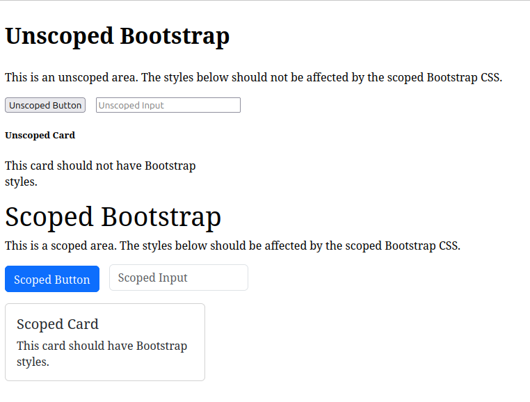

# Scoped Bootstrap

This module allows you to generate a scoped Bootstrap CSS file, to be used in specific parts of your project, avoiding global style conflicts. It processes the Bootstrap CSS and adds a scope prefix, so you can use Bootstrap components only where you want.

This script was built based on [this answer in a Stack Overflow discussion](https://stackoverflow.com/a/79078411)

## Demonstration



The demonstration code is available in `examples/index.html`

```html
<!DOCTYPE html>
<html lang="en">
  <head>
    <meta charset="UTF-8" />
    <meta name="viewport" content="width=device-width, initial-scale=1.0" />
    <title>Scoped Bootstrap Demo</title>
    <link rel="stylesheet" href="../output/bootstrap.css" />
  </head>
  <body>
    <div>
      <h2>Unscoped Bootstrap</h2>
      <p>
        This is an unscoped area. The styles below should not be affected by the
        scoped Bootstrap CSS.
      </p>
      <button class="btn btn-primary">Unscoped Button</button>
      <input
        type="text"
        class="form-control"
        placeholder="Unscoped Input"
        style="width: 200px; display: inline-block; margin-left: 10px"
      />
      <div class="card" style="width: 18rem; margin-top: 1rem">
        <div class="card-body">
          <h5 class="card-title">Unscoped Card</h5>
          <p class="card-text">This card should not have Bootstrap styles.</p>
        </div>
      </div>
    </div>

    <div class="bootstrap-scope">
      <h2>Scoped Bootstrap</h2>
      <p>
        This is a scoped area. The styles below should be affected by the scoped
        Bootstrap CSS.
      </p>
      <button class="btn btn-primary">Scoped Button</button>
      <input
        type="text"
        class="form-control"
        placeholder="Scoped Input"
        style="width: 200px; display: inline-block; margin-left: 10px"
      />
      <div class="card" style="width: 18rem; margin-top: 1rem">
        <div class="card-body">
          <h5 class="card-title">Scoped Card</h5>
          <p class="card-text">This card should have Bootstrap styles.</p>
        </div>
      </div>
    </div>
  </body>
</html>
```

## Installation

1. Clone the repository
2. Install the dependencies:
   ```bash
   npm install
   ```
3. Run the start script to generate the scoped CSS:
   ```bash
   npm run start
   ```

## Usage

After running the script, the file `output/bootstrap.css` will be generated with the defined scope. To apply the scoped Bootstrap in your HTML, just add the scope class to the desired element:

```html
<link rel="stylesheet" href="../output/bootstrap.css" />
```

```html
<div class="bootstrap-scope">
  <button class="btn btn-primary">Scoped Button</button>
</div>
```

## Usage with React

You can also import the scoped file to use in React components

```jsx
import "./bootstrap.css";

export default function MyComponent() {
  return (
    <div className="bootstrap-scope">
      <button class="btn btn-primary">Scoped Button</button>
    </div>
  );
}
```

## Configuration

Settings can be adjusted in the `src/config.json` file:

- `scopePrefix`: Desired scope prefix
- `inputDir`: Directory where the `bootstrap.css` file will be copied from the installed dependency. If you don't want to install from a dependency, if you already have the file, you can copy it directly to the `input` folder
- `outputDir`: Final directory for the scoped `.css` file after running the script
- `sourcePath`: Path to the `bootstrap.css` file that will be copied from the dependency

```json
{
  "scopePrefix": "bootstrap-scope",
  "inputDir": "input",
  "outputDir": "output",
  "sourcePath": "node_modules/bootstrap/dist/css/bootstrap.css"
}
```

You can change the value of `scopePrefix` to set the name of the scope class that will be used in your HTML.

## Using a specific Bootstrap version

If you want to use a specific version, you can:

- Bring the `bootstrap.css` file to the `input` directory
- Or change the Bootstrap version in the `package.json` file, reinstall the dependencies and run the script normally

## CSS Minification Step

After generating the scoped Bootstrap CSS, an additional minification step is performed automatically. This step uses the [clean-css-cli](https://www.npmjs.com/package/clean-css-cli) tool to minify the `output/bootstrap.css` file, producing a `output/bootstrap.min.css` file with optimized size and a source map.

The minification script and its options were chosen based on recommendations from the official Bootstrap team, as discussed in this [GitHub discussion](https://github.com/orgs/twbs/discussions/38698). This ensures compatibility and follows best practices for CSS optimization in Bootstrap projects.

## Caveats

**This mechanism has not been fully tested for Bootstrap functionalities that depend on Javascript, such as modals, popovers, etc.**

For most components with basic styling, it will work normally. For components with Javascript, you will need to test specific cases.

**If this does not work for your project, you may want to try recompiling Bootstrap**

Following other comments in the referenced Stack Overflow discussion, a more robust solution would be to download the Bootstrap source files, modify the `.scss` files to add the desired scope, and recompile the code, generating a new scoped `dist`.

**About the code after minification**

The minification step was performed by trying to recreate the minify script used in the Bootstrap repository. However, after our scope substitutions, I cannot fully guarantee that the code is completely scoped and minified. If you encounter any unexpected styling results, try switching the import in your project between `.min.css` and `.css`.
